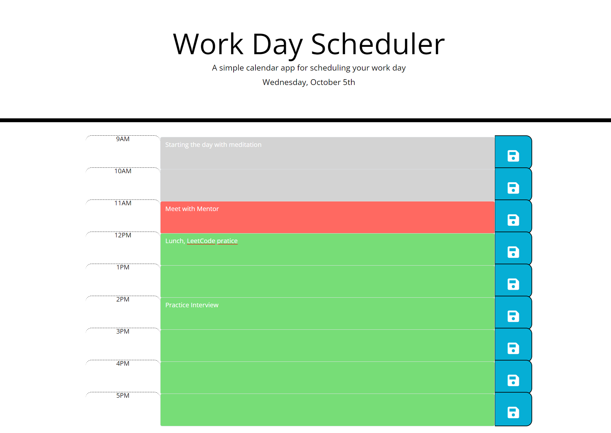

# Daily_Scheduler

## Description

This project displays the day, so you can plan out your busy schedule. I wanted to use components from Bootstrap and JQuery. Bootstrap is used to construct all of the HTML. I was able to easily incorporate Bootstrap for a grid. I used JQuery in the javascript file. I used it to manage the on click functionality to save. JQuery made traversing the DOM a piece of cake. I was able to use moment to set the day of the week, and month on the page.

Here is a screenshot of how I would use the webpage:


I wanted to dynamically save the text area on they page, not just iterate through the rows. I aimed to grab the id of the button that was clicked, which I would use to find out which row's text area was being saved. I used jquery to traverse the page and save the text. The code below shows how I accomplished this. 

```javascript
$(".saveBtn").on("click", function () {

    //use this to save to the object
    var saveId = $(this).siblings(".timeDisplay").children().attr("id");
    //grabbing object 
    var day = loadfromLS();
    //this saves the property that is saveId to the val in the text area
    day[saveId] = $(this).siblings(".description").val();

    //save to LS
    saveToLS(day);
});
```
Once I checked the time was during work day hours, I went ahead and compared the time to set the background colors. I did so by adding the class that was appropriate to the hour. If it was a past hour I greyed it out. If it was during that hour I sent the class to present, and the last defaults to furture. 

```javascript
if ($(this).attr("id") == now) {
                $(this).parent().siblings(".description").addClass("present");
            }
            else if ($(this).attr("id") <= now) {
                $(this).parent().siblings(".description").addClass("past");
            }
            else {
                $(this).parent().siblings(".description").addClass("future");
            }
```

## Installation

No installation required. Simply go to github page.

Here is the link to see how I built the webpage with HTML, CSS, and javasript.

[Github Repo](https://github.com/johnfrom209/Daily_Scheduler)

[Deployed Page](https://johnfrom209.github.io/Daily_Scheduler/)

## Usage

In order to use this project for your busy schedule, please go to the deployed page. Once you are there you can click inside of the text area and begin typing. After that if you wish to save your text then click the button to the side, that is on the same row. If you wish to edit the text content, you can simply click inside the text area and edit. If you write inside the text area and leave the page without saving then the text will be lost. However, anything saved before then will continue to load on the page. 

## Credits

Starter code provided by UCB coding bootcamp.
Uses JQuery, moment, and bootstrap.

## Contact Me

[Linkedin](https://www.linkedin.com/in/johnfrom209/)

[View my Github Repo](https://github.com/johnfrom209)

## License

Refer to the license in the Github repo.
